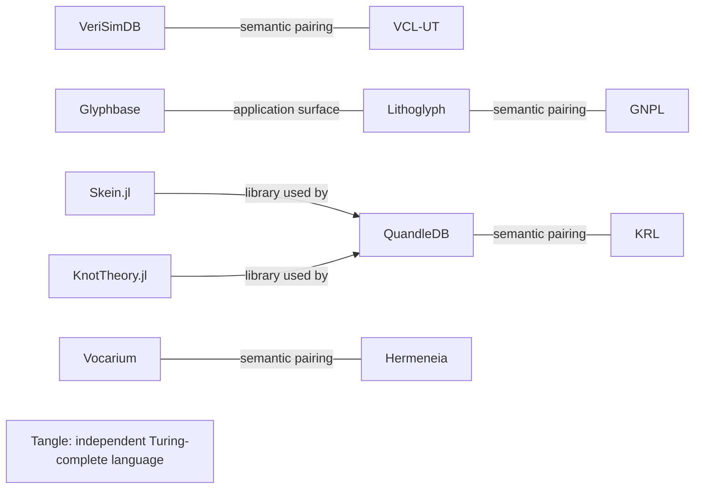

<!-- SPDX-License-Identifier: CC-BY-SA-4.0 -->
# Portfolio relationships

Lines labelled “semantic pairing” describe design relationships; they do not
assert a working integration or transferred proof guarantee.

The four languages express different obligations: consonance/admissibility,
narration/warrants, knot resolution, and use-relative sufficiency. Shared storage
or retrieval mechanisms do not make their semantics interchangeable.

Skein.jl, KnotTheory.jl and Tangle have independent purposes. Their common knot
subject matter does not turn them into successive compiler stages or assign each
a single KRL operation.

[Registry](REGISTRY.adoc) identifies canonical repositories.
[Evidence ledger](EXPLAINME.adoc) states tested boundaries and remaining gaps.
[Roadmap](ROADMAP.adoc) identifies the next substantive implementation work.
